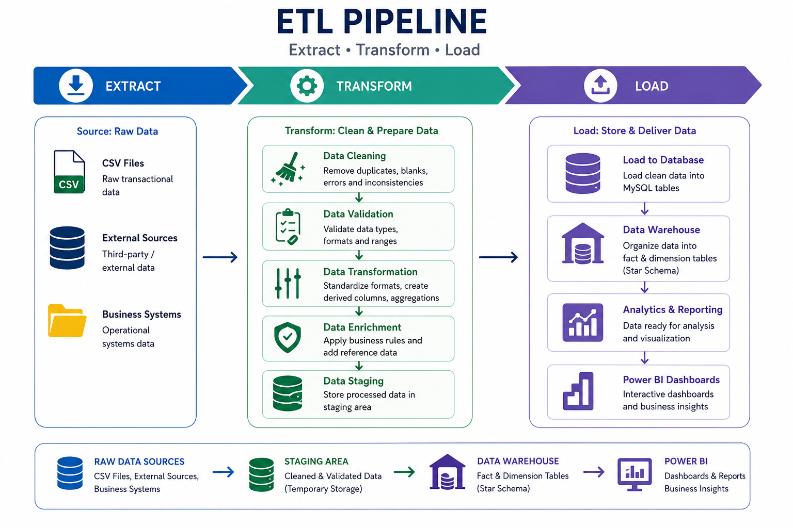
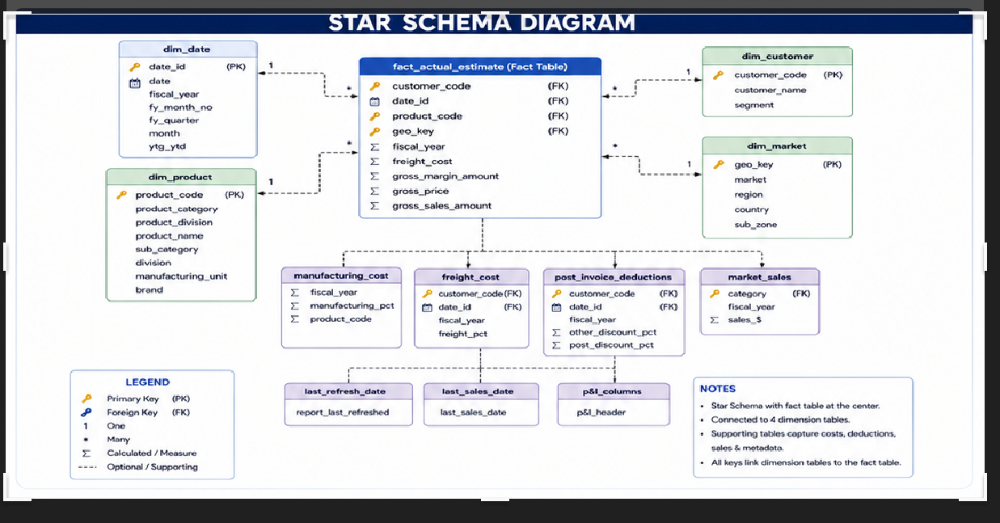

# 🚀 End-to-End Data Engineering & Business Intelligence Platform

<div align="center">

### Production-Style Retail Analytics Solution

Transforming raw retail transactional data into business-ready insights using **Python, MySQL, Advanced SQL, Data Warehousing, and Power BI**.


</div>

---

# 📖 Project Overview

This project demonstrates the complete lifecycle of building a production-style Business Intelligence solution, starting from a raw retail CSV dataset and ending with interactive executive dashboards.

Instead of directly importing CSV data into Power BI, a complete analytics pipeline was developed using Python for ETL, MySQL for database management, Advanced SQL for business transformation, and Power BI for interactive reporting.

The solution follows a structured analytics workflow commonly used in enterprise environments where raw data is extracted, validated, transformed, modeled, analyzed, and finally delivered through business-ready dashboards for decision-makers.

The project combines **Data Engineering, Data Warehousing, SQL Development, Business Intelligence, and Forecast Analytics** into a single end-to-end solution.

---

# 🎯 Business Problem

Retail organizations generate millions of transactional records that capture sales activities across multiple customers, products, markets, and time periods.

However, raw transactional data alone cannot answer important business questions because it lacks:

- Structured analytical models
- Pricing information
- Cost information
- Forecasting data
- Business KPIs
- Profitability calculations
- Executive reporting

Business stakeholders require reliable insights to answer questions such as:

- Which markets generate the highest revenue?
- Which customers contribute the most to overall sales?
- Which products drive business growth?
- How do regional sales compare across fiscal years?
- How accurate are monthly sales forecasts?
- Which operational costs impact profitability?
- Which regions require business attention?
- Which customers or products underperform against forecast?

To solve these challenges, a complete analytics platform was designed using modern Data Engineering and Business Intelligence practices.

---

# 🎯 Project Objectives

The primary objective of this project is to simulate a real-world enterprise analytics workflow by building a complete data pipeline from raw transactional data to executive dashboards.

The project focuses on:

- Building an automated ETL pipeline using Python
- Importing raw CSV datasets into MySQL
- Cleaning and validating transactional data
- Handling NULL values using SQL
- Standardizing data types and business structures
- Designing a dimensional Data Warehouse
- Implementing advanced SQL business logic
- Preparing analytical business datasets
- Building multi-dimensional forecasting models
- Creating executive Power BI dashboards
- Delivering actionable business insights

---

# 🌍 Why This Project?

Many portfolio projects directly connect a CSV dataset to Power BI.

This project follows a significantly broader enterprise analytics workflow by implementing:

- Python ETL
- SQL-based Data Cleaning
- NULL Value Handling
- Data Structuring
- Data Warehousing
- Advanced SQL Development
- Business Data Preparation
- Forecast Validation
- Executive Dashboards

This approach closely reflects how modern organizations prepare data before it reaches Business Intelligence tools.

---

# 🌟 Project Scope

The project covers every major stage of a modern analytics solution.

---

## 🔹 Data Engineering

The Data Engineering layer focuses on transforming raw transactional data into a structured and reliable analytical dataset.

Key activities include:

- Raw CSV Data Extraction
- Automated Python ETL Pipeline
- Bulk Data Loading into MySQL
- Data Type Conversion
- SQL-Based NULL Value Handling
- Column Name Standardization
- Schema Validation
- Data Cleaning
- Data Structuring
- Data Integrity Checks
- Error Handling

---

## 🔹 Data Warehousing

A dimensional warehouse was designed to organize business data for efficient reporting and analytics.

Warehouse implementation includes:

- Star Schema Design
- Fact Tables
- Dimension Tables
- Business Data Modeling
- Relational Database Design
- Optimized Analytical Structure

---

## 🔹 Business Data Preparation

The project initially started with a single raw retail transaction dataset.

To simulate an enterprise-level retail analytics environment, additional analytical datasets and supporting business tables were prepared and integrated into the data warehouse.

Business preparation includes:

- SQL-Based Data Transformation
- SQL-Based NULL Handling
- Data Structuring
- Pricing Integration
- Cost Integration
- Business Rule Implementation
- Forecast Integration

Supporting analytical datasets include:

- Gross Price
- Manufacturing Cost
- Freight Cost
- Pre-Invoice Deductions
- Post-Invoice Deductions
- Operational Expenses
- Market Information
- Monthly Sales Forecast

The forecasting framework supports analysis across multiple business dimensions:

- Customer-wise Forecast
- Product-wise Forecast
- Market-wise Forecast
- Region-wise Forecast
- Sub-Zone-wise Forecast
- Monthly Forecast
- Fiscal Year Forecast
- Forecast Accuracy
- Net Error Analysis
- Absolute Error Analysis
- Forecast Bias Analysis

These datasets were integrated using SQL business logic and relational modeling to support profitability analysis, forecasting, and executive reporting.

---

## 🔹 Advanced SQL

Advanced SQL was implemented to perform enterprise-level business analysis and database optimization.

Key SQL features include:

- SQL-Based Data Cleaning
- UPDATE Queries
- CASE WHEN Expressions
- COALESCE()
- IFNULL()
- Data Transformation
- Views
- Stored Procedures
- SQL Functions
- Window Functions
- Common Table Expressions (CTEs)
- Business Analysis Queries
- Forecast Validation
- Data Validation
- Data Profiling
- Triggers
- Events
- Indexing
- Query Optimization

---

## 🔹 Business Intelligence

Business Intelligence was implemented using Power BI to transform analytical data into interactive dashboards.

The reporting layer includes:

- Power Query Transformations
- DAX Measures
- KPI Development
- Executive Reporting
- Interactive Dashboards

Dashboard modules include:

- Executive Dashboard
- Finance Dashboard
- Sales Dashboard
- Marketing Dashboard
- Supply Chain Dashboard
- Forecast Analysis Dashboard

---

# 🔄 End-to-End Workflow

```text
Raw Retail CSV Dataset
          │
          ▼
Python ETL Pipeline
          │
          ▼
MySQL Database
          │
          ▼
SQL Data Cleaning & NULL Handling
          │
          ▼
Business Data Preparation
          │
          ▼
Dimensional Data Warehouse
          │
          ▼
Advanced SQL Analytics
          │
          ▼
Forecast Validation
          │
          ▼
Power BI Dashboards
          │
          ▼
Business Insights & Executive Reporting
```

---

# 🛠️ Technology Stack

| Category | Technologies |
|----------|--------------|
| Programming Language | Python |
| Database | MySQL |
| Query Language | SQL |
| ETL | Python |
| Data Cleaning | SQL |
| Data Warehousing | Star Schema |
| Business Logic | Advanced SQL |
| Data Transformation | Power Query |
| Business Intelligence | Power BI |
| Analytics | DAX |
| Version Control | Git & GitHub |
| Data Source | Retail CSV Dataset |

---

# ⭐ Project Highlights

- ✅ End-to-End Data Engineering Pipeline
- ✅ Automated Python ETL Workflow
- ✅ SQL-Based Data Cleaning
- ✅ SQL-Based NULL Value Handling
- ✅ Business Data Structuring
- ✅ Production-Style Data Warehouse
- ✅ Star Schema Implementation
- ✅ Advanced SQL Development
- ✅ Business Data Preparation
- ✅ Forecast Data Integration
- ✅ Customer-wise Forecasting
- ✅ Product-wise Forecasting
- ✅ Market-wise Forecasting
- ✅ Region-wise Forecasting
- ✅ Sub-Zone-wise Forecasting
- ✅ Fiscal Year Forecasting
- ✅ Monthly Forecast Analysis
- ✅ Forecast Accuracy Measurement
- ✅ Net Error Analysis
- ✅ Absolute Error Analysis
- ✅ Forecast Bias Analysis
- ✅ Data Validation & Profiling
- ✅ Query Optimization
- ✅ Interactive Power BI Dashboards
- ✅ Executive Business Reporting
- ✅ Decision Support Analytics


---

# 🏗️ Solution Architecture

The project follows a production-style analytics architecture that transforms raw transactional data into business-ready insights through a structured Data Engineering and Business Intelligence workflow.

Unlike traditional dashboard projects, this solution separates data ingestion, transformation, warehousing, business logic, and reporting into independent layers, closely simulating an enterprise analytics environment.

<div align="center">


</div>

---

## 🏛️ Architecture Layers

### 1️⃣ Data Source Layer

The project begins with raw retail transactional datasets stored in CSV format.

The source data contains:

- Customer Information
- Product Information
- Sales Transactions
- Market Information
- Forecast Data
- Pricing & Cost Data

---

### 2️⃣ Data Engineering Layer

Python was used to automate the ETL process.

Major responsibilities include:

- Reading Raw CSV Files
- Data Type Conversion
- Bulk Loading into MySQL
- ETL Automation
- Error Handling

---

### 3️⃣ Database Layer

All datasets are stored inside MySQL before analytical processing.

Database responsibilities include:

- Centralized Data Storage
- Relational Data Management
- SQL Processing
- Data Consistency

---

### 4️⃣ SQL Transformation Layer

After loading the raw datasets, SQL was used to prepare business-ready data.

Transformation activities include:

- SQL-Based NULL Value Handling
- UPDATE Queries
- CASE WHEN Logic
- COALESCE() / IFNULL()
- Business Rule Implementation
- Data Standardization
- Data Structuring
- Forecast Preparation

---

### 5️⃣ Data Warehouse Layer

A dimensional warehouse was designed using Star Schema.

Warehouse components include:

- Fact Tables
- Dimension Tables
- Business Lookup Tables
- Optimized Relationships

The warehouse enables high-performance analytical queries and reporting.

---

### 6️⃣ Business Analytics Layer

Advanced SQL was used to perform enterprise-level business analysis.

Features include:

- Views
- Stored Procedures
- SQL Functions
- Window Functions
- Common Table Expressions (CTEs)
- Business Analysis Queries
- Forecast Validation
- Data Validation
- Data Profiling
- Query Optimization

---

### 7️⃣ Business Intelligence Layer

Power BI consumes the analytical warehouse and provides interactive dashboards for business users.

Dashboard modules include:

- Executive Dashboard
- Finance Dashboard
- Sales Dashboard
- Marketing Dashboard
- Supply Chain Dashboard
- Forecast Dashboard

---

# 🔄 ETL Pipeline

The project follows a structured ETL workflow for transforming raw retail data into analytical datasets.

<div align="center">



</div>

### ETL Process

```text
Extract
│
├── Read CSV Files
├── Import Source Data
└── Validate Input Files

↓

Transform
│
├── SQL-Based NULL Handling
├── Data Cleaning
├── Data Structuring
├── Data Type Conversion
├── Business Rule Implementation
├── Forecast Data Preparation
└── Data Validation

↓

Load
│
├── MySQL Database
├── Data Warehouse
├── Fact Tables
└── Dimension Tables
```

---

# 🗄️ Database Architecture

The MySQL database acts as the central repository for storing transactional, dimensional, and analytical datasets.

Database architecture consists of:

### Fact Tables

- fact_sales_monthly
- fact_forecast_monthly

### Dimension Tables

- dim_customer
- dim_product
- dim_market
- dim_date

### Supporting Tables

- gross_price
- manufacturing_cost
- freight_cost
- pre_invoice_deductions
- post_invoice_deductions

---

# ⭐ Star Schema Design

A Star Schema was implemented to optimize reporting performance and simplify business analytics.

<div align="center">



</div>

### Benefits

- Faster Query Performance
- Simplified Reporting
- Optimized Relationships
- Better Scalability
- Reduced Data Redundancy

---

# 🔗 Entity Relationship Diagram (ERD)

The warehouse uses relational keys to connect dimension tables with fact tables.

<div align="center">


</div>

Primary relationships include:

- Customer → Sales
- Product → Sales
- Market → Sales
- Date → Sales
- Product → Pricing
- Customer → Invoice Deductions
- Product → Manufacturing Cost
- Forecast → Sales

---

# 📂 Project Structure

```text
End-to-End-Data-Engineering-and-Business-Intelligence/
│
├── Dataset/
│
├── Python/
│   ├── ETL Scripts
│   └── Data Loading
│
├── SQL/
│   ├── Database Setup
│   ├── Dimension Tables
│   ├── Fact Tables
│   ├── Views
│   ├── Functions
│   ├── Stored Procedures
│   ├── Business Analysis
│   ├── Window Functions
│   ├── Data Validation
│   ├── Data Profiling
│   ├── Forecast Validation
│   ├── Indexes
│   ├── Triggers
│   ├── Events
│   └── Query Optimization
│
├── PowerBI/
│   ├── Dashboard.pbix
│   ├── Dashboard.pdf
│   └── Screenshots/
│
├── Images/
│   ├── architecture.png
│   ├── etl_pipeline.png
│   ├── star_schema.png
│   └── er_diagram.png
│
├── Documentation/
│
├── README.md
│
└── LICENSE
```

---

# 📌 Key Design Principles

The project was designed using industry-standard Data Engineering and Business Intelligence practices.

Key principles include:

- Modular ETL Pipeline
- Layered Architecture
- Relational Database Design
- Star Schema Modeling
- SQL-Based Business Logic
- Data Validation & Quality Checks
- Forecast Validation Framework
- Interactive Business Reporting
- Scalable Analytics Workflow
- Decision Support System

---

---

# 💻 Python ETL Pipeline

The ETL (Extract, Transform, Load) process was developed using Python to automate the ingestion of raw retail datasets into MySQL.

The pipeline performs initial preprocessing before the SQL transformation layer.

### ETL Features

- CSV File Extraction
- Automated Data Loading
- Bulk Insert into MySQL
- Data Type Conversion
- Date Formatting
- Column Standardization
- Exception Handling
- Logging & Validation

---

# 🧹 SQL Data Cleaning & Transformation

After loading the datasets into MySQL, SQL was used to clean, standardize, and prepare business-ready analytical data.

### Data Cleaning Activities

- SQL-Based NULL Value Handling
- UPDATE Queries
- CASE WHEN Expressions
- COALESCE() Function
- IFNULL() Function
- Duplicate Record Handling (if applicable)
- Data Type Corrections
- Business Rule Implementation
- Data Standardization
- Data Structuring

---

# 🏗️ Data Warehouse Implementation

A dimensional data warehouse was designed using a Star Schema to support high-performance analytical reporting.

### Fact Tables

- fact_actual_estimate
- fact_forecast_monthly

### Dimension Tables

- dim_customer
- dim_product
- dim_market
- dim_date

### Supporting Tables

- gross_price
- manufacturing_cost
- freight_cost
- pre_invoice_deductions
- post_invoice_deductions

---

# ⚡ Advanced SQL Development

Advanced SQL was implemented to transform transactional data into analytical datasets and business KPIs.

### SQL Features

- Complex JOIN Operations
- Aggregate Functions
- CASE WHEN Logic
- CTEs (Common Table Expressions)
- Window Functions
- Views
- Stored Procedures
- User Defined Functions
- Temporary Tables (if applicable)
- Subqueries
- Query Optimization

---

# 📊 Business Analysis Queries

Business queries were developed to answer real-world business questions.

Examples include:

- Top Customers by Revenue
- Top Products by Sales
- Market Performance Analysis
- Customer Contribution Analysis
- Product Contribution Analysis
- Monthly Sales Trend
- Fiscal Year Sales Analysis
- Profitability Analysis
- Regional Sales Analysis
- Sub-Zone Performance Analysis

---

# 📈 Forecast Analytics

A forecasting framework was implemented to compare actual sales with forecasted sales.

### Forecast Dimensions

- Customer-wise Forecast
- Product-wise Forecast
- Market-wise Forecast
- Region-wise Forecast
- Sub-Zone-wise Forecast
- Monthly Forecast
- Fiscal Year Forecast

### Forecast KPIs

- Forecast Accuracy
- Forecast Bias
- Net Error
- Absolute Error
- Error Percentage

---

# ✅ Data Validation

Data quality checks were performed to ensure reliable reporting.

Validation includes:

- NULL Value Validation
- Duplicate Record Validation
- Missing Customer Validation
- Missing Product Validation
- Invalid Date Validation
- Referential Integrity Validation

---

# 🔍 Data Profiling

Data profiling was performed before analytical reporting.

Profiling activities include:

- Record Count Validation
- Distinct Value Analysis
- Data Distribution Analysis
- Missing Value Analysis
- Data Type Verification
- Outlier Identification (where applicable)

---

# ⚙️ Database Optimization

Database optimization techniques were implemented to improve SQL performance.

Optimization includes:

- Index Creation
- Query Optimization
- Optimized JOIN Strategy
- Execution Plan Analysis (if applicable)

---

# 🔄 Database Automation

Automation features implemented in MySQL include:

- Stored Procedures
- SQL Functions
- Database Triggers
- Scheduled Events

These components automate repetitive business logic and improve maintainability.

---

# 🎯 Key Technical Skills Demonstrated

This project demonstrates practical implementation of:

- Python ETL
- MySQL Database Design
- Advanced SQL
- Data Cleaning
- Data Warehousing
- Star Schema Modeling
- Forecast Analytics
- Business Intelligence
- Query Optimization
- Data Validation
- Data Profiling
- Power BI Reporting

---

# 📊 Power BI Business Intelligence Dashboard

Interactive dashboards were developed in Power BI to transform warehouse data into meaningful business insights. The dashboards enable executives, finance teams, sales managers, and supply chain teams to make data-driven decisions.

---

# 🖼️ Dashboard Overview

<p align="center">

</p>

The dashboard provides a centralized view of business performance across multiple functional areas.

---

# 🏠 Home Dashboard

<p align="center">

</p>

### Key Features

- Navigation Menu
- KPI Summary
- Interactive Filters
- Business Overview
- Dynamic Navigation Buttons

---

# 💰 Finance Dashboard

<p align="center">

</p>

### Finance KPIs

- Net Sales
- Gross Sales
- Gross Margin
- Gross Margin %
- Net Profit
- Year-over-Year Growth

---

# 📈 Sales Dashboard

<p align="center">

</p>

### Sales Analysis

- Sales by Customer
- Sales by Product
- Sales by Market
- Monthly Sales Trend
- Top Performing Products
- Top Customers

---

# 📢 Marketing Dashboard

<p align="center">

</p>

### Marketing Insights

- Customer Contribution
- Product Contribution
- Market Share
- Regional Performance
- Customer Segmentation

---

# 🚚 Supply Chain Dashboard

<p align="center">

</p>

### Supply Chain KPIs

- Forecast Accuracy
- Forecast Bias
- Net Error
- Absolute Error
- Customer Forecast Performance
- Product Forecast Performance

---

# 👔 Executive Dashboard

<p align="center">

</p>

### Executive KPIs

- Revenue Overview
- Gross Margin
- Profitability
- Top Markets
- Top Customers
- Top Products
- Year-over-Year Growth

---

# 📌 Power BI Features Used

### Data Preparation

- Power Query
- Data Cleaning
- Data Transformation
- Relationship Management
- Data Modeling

### DAX Measures

- Net Sales
- Gross Margin
- Gross Margin %
- Net Profit
- Forecast Accuracy
- Forecast Bias
- Year-over-Year Growth
- Running Total
- Contribution %

### Interactive Features

- Slicers
- Drill-through
- Bookmarks
- Tooltips
- Cross Filtering
- Dynamic Titles
- Navigation Buttons

---

# 📈 Key Performance Indicators (KPIs)

The dashboards monitor important business metrics including:

- Net Sales
- Gross Sales
- Gross Margin
- Gross Margin %
- Forecast Accuracy
- Forecast Bias
- Customer Performance
- Product Performance
- Regional Performance
- Market Performance

---

# 🎯 Business Value

The Power BI solution enables stakeholders to:

- Monitor business performance in real time
- Track revenue and profitability
- Analyze customer and product performance
- Improve forecast accuracy
- Identify high-performing markets
- Support strategic decision-making through interactive dashboards


---

# 📈 Business Insights & Key Findings

The analytics solution transformed raw retail data into meaningful business insights, enabling data-driven decision-making across Finance, Sales, Marketing, and Supply Chain.

---

# 💰 Financial Insights

Key financial observations include:

- Revenue trend analysis across fiscal years
- Gross Margin and Gross Margin % evaluation
- Profitability analysis by customer and product
- Identification of high-value customers
- Revenue contribution by market and region

---

# 📊 Sales Insights

Sales analysis helped identify business growth opportunities.

### Key Findings

- Top-performing customers
- Best-selling products
- High-revenue markets
- Monthly sales trends
- Regional sales comparison
- Product category performance

---

# 🌍 Market Performance Insights

Market-level analysis highlighted regional business performance.

### Analysis Includes

- Revenue by Market
- Revenue by Region
- Revenue by Sub-Zone
- Market Growth Comparison
- Top & Bottom Performing Markets

---

# 👥 Customer Insights

Customer analytics provided a deeper understanding of purchasing behavior.

### Insights

- Top Revenue Customers
- Customer Contribution %
- Customer Ranking
- Customer-wise Sales Trend
- High-Value Customer Identification

---

# 📦 Product Insights

Product analytics supported inventory and product strategy.

### Insights

- Best Selling Products
- Product Revenue Contribution
- Product Category Performance
- Product Division Analysis
- Low Performing Products

---

# 🚚 Supply Chain & Forecast Insights

Forecast analysis improved demand planning and supply chain visibility.

### Forecast Metrics

- Forecast Accuracy
- Forecast Bias
- Net Error
- Absolute Error
- Customer Forecast Accuracy
- Product Forecast Accuracy
- Market Forecast Accuracy

---

# 📌 Business Impact

This solution helps organizations to:

- Improve business decision-making
- Increase reporting efficiency
- Monitor KPIs in real time
- Identify profitable customers and products
- Improve sales forecasting
- Optimize inventory planning
- Support executive decision-making

---

# 🚀 Skills Demonstrated

This project demonstrates practical experience in:

### Programming

- Python
- SQL

### Data Engineering

- ETL Pipeline
- Data Cleaning
- Data Warehousing
- Star Schema Design

### Database

- MySQL
- Views
- Stored Procedures
- Functions
- Window Functions
- Query Optimization

### Business Intelligence

- Power BI
- DAX
- Power Query
- Interactive Dashboards
- KPI Reporting

---

# 📚 Key Learnings

During this project, I gained hands-on experience in:

- Designing an end-to-end analytics solution
- Building scalable ETL pipelines
- Developing a dimensional data warehouse
- Writing advanced SQL queries
- Creating interactive Power BI dashboards
- Performing business analysis using real-world retail data
- Translating raw data into actionable business insights

---

# 🎯 Project Outcome

This project successfully demonstrates an end-to-end Business Intelligence solution that integrates Python, MySQL, SQL, Data Warehousing, and Power BI into a single analytics workflow.

It showcases practical skills in data engineering, business intelligence, and data analytics while solving real-world retail business problems.


---

# 🚀 Getting Started

Follow these steps to run the project locally.

## Prerequisites

Make sure the following software is installed:

- Python 3.10+
- MySQL Server 8.0+
- MySQL Workbench
- Power BI Desktop
- Git
- Visual Studio Code (Optional)

---

# 📥 Installation

### 1️⃣ Clone the Repository

```bash
git clone https://github.com/atishayjain777/End-to-End-Data-Engineering-and-Business-Intelligence
```

### 2️⃣ Navigate to Project Folder

```bash
cd End-to-End-Data-Engineering-and-Business-Intelligence
```

### 3️⃣ Create the Database

Run the SQL scripts located in:

```https://github.com/atishayjain777/End-to-End-Data-Engineering-and-Business-Intelligence/tree/main/SQL/02_Dimension_Tables
https://github.com/atishayjain777/End-to-End-Data-Engineering-and-Business-Intelligence/tree/main/SQL/03_Fact_Tables
```

---

### 4️⃣ Load Raw Data

Place all CSV files inside:

https://github.com/atishayjain777/End-to-End-Data-Engineering-and-Business-Intelligence/tree/main/Dataset

```

```

Run the Python ETL script to load data into MySQL.
https://github.com/atishayjain777/End-to-End-Data-Engineering-and-Business-Intelligence/blob/main/Python/main.py/05_MAIN.py

### 5️⃣ Execute SQL Scripts

Run the SQL files in the following order:

Database Setup
↓
Dimension Tables
↓
Fact Tables
↓
Data Cleaning
↓
Views
↓
Functions
↓
Stored Procedures
↓
Window Functions
↓
Data Validation
↓
Data Profiling
↓
Forecast Validation
↓
Indexes
↓
Triggers
↓
Events
↓
Business Analysis Queries
↓
Query Optimization

### 6️⃣ Open Power BI Dashboard

Open the Power BI report:

```
PowerBI/Global_Estore_Dashboard.pbix
```

Refresh the data source and explore the dashboards.

---

# 📁 Project Structure

```text
End-to-End-Data-Engineering-and-Business-Intelligence/
│
├── Dataset/
│   ├── Raw_Data/
│   │   ├── dim_customer.csv
│   │   ├── dim_product.csv
│   │   ├── dim_market.csv
│   │   ├── fact_sales_monthly.csv
│   │   ├── fact_forecast_monthly.csv
│   │   ├── gross_price.csv
│   │   ├── manufacturing_cost.csv
│   │   ├── freight_cost.csv
│   │   ├── pre_invoice_deductions.csv
│   │   └── post_invoice_deductions.csv
│   │
│   ├── Processed_Data/
│   │   ├── helper.csv
│   │   ├── helper_clean.csv
│   │   └── final_dataset.csv
│   │
│   └── README.md
│
├── Documentation/
│   ├── 01_Project_Report.pdf
│   ├── 02_Solution_Architecture.png
│   ├── 03_Data_Flow_Diagram.png
│   ├── 04_ETL_Pipeline.png
│   ├── 05_Star_Schema.png
│   ├── 06_ER_Diagram.png
│   └── README.md
│
├── Images/
│   ├── dashboard_overview.png
│   ├── home_dashboard.png
│   ├── executive_dashboard.png
│   ├── finance_dashboard.png
│   ├── sales_dashboard.png
│   ├── marketing_dashboard.png
│   ├── supply_chain_dashboard.png
│   ├── solution_architecture.png
│   ├── data_flow_diagram.png
│   ├── etl_pipeline.png
│   ├── star_schema.png
│   └── er_diagram.png
│
├── PowerBI/
│   ├── Global_Estore_Dashboard.pdf
│   ├── README.md
│   └── Screenshots/
│
├── Python/
│   ├── 01_Read_CSV.py
│   ├── 02_Clean_Data.py
│   ├── 03_Database_Connection.py
│   ├── 04_Load_Data.py
│   ├── requirements.txt
│   └── README.md
│
├── SQL/
│   ├── 01_Database_Setup/
│   ├── 02_Dimension_Tables/
│   ├── 03_Fact_Tables/
│   ├── 04_Data_Cleaning/
│   ├── 05_Views/
│   ├── 06_Functions/
│   ├── 07_Stored_Procedures/
│   ├── 08_Window_Functions/
│   ├── 09_Business_Analysis/
│   ├── 10_Data_Validation/
│   ├── 11_Data_Profiling/
│   ├── 12_Forecast_Validation/
│   ├── 13_Indexes/
│   ├── 14_Triggers/
│   ├── 15_Events/
│   ├── 16_Query_Optimization/
│   └── README.md
│
├── README.md
├── LICENSE
├── .gitignore
└── requirements.txt
```
# 🚀 Future Improvements

Planned enhancements include:

- Cloud Deployment (AWS/Azure)
- Automated ETL Scheduling
- Incremental Data Loading
- CI/CD Pipeline Integration
- Real-Time Dashboard Updates
- Data Quality Monitoring
- Role-Based Dashboard Security
- Performance Optimization

---

# 📌 Repository Highlights

✔ End-to-End Data Engineering Project

✔ Python ETL Pipeline

✔ MySQL Data Warehouse

✔ Star Schema Design

✔ Advanced SQL

✔ Views & Stored Procedures

✔ Business Analysis

✔ Forecast Analytics

✔ Power BI Dashboards

✔ Executive Reporting

---

# 🤝 Connect With Me

**Atishay Jain**

- LinkedIn: https://https://www.linkedin.com/feed/
- GitHub: https://https://github.com/atishayjain777
- Email: your-atishayjain849@gmail.com

---

# 📄 License

This project is licensed under the **MIT License**.


---

# ⭐ Support

If you found this project useful:

- ⭐ Star this repository
- 🍴 Fork this repository
- 💡 Share your feedback
- 🤝 Connect with me on LinkedIn

---

# 🙏 Acknowledgements

Special thanks to:

- Codebasics
- Power BI Community
- MySQL Documentation
- Python Community
- Open Source Community

---

> **If you found this project helpful, please consider giving it a ⭐ on GitHub.**
